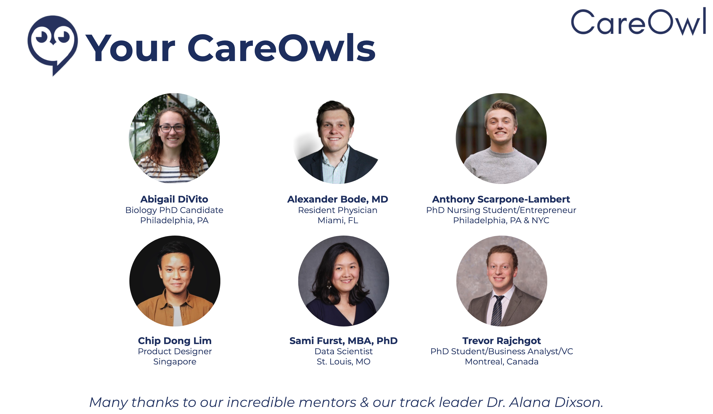

# Our Story

**Winner of the MIT COVID-19 Challenge (close to 2000 global participants)**

We are a diverse and energetic team that met during the MIT COVID-19 Challenge in May 2020. We have a common goal of working collaboratively to create solutions for this global health criss, specifically, solving problems facing those that live and work in the new hotspot: nursing homes and assisted living facilities.

Over the course of 48 hours, our team worked closely to identify the problem, sketch out ideas, design implementation plan, establish user experience, create a storytelling process, and pitch our ideas to a panel of judges.

